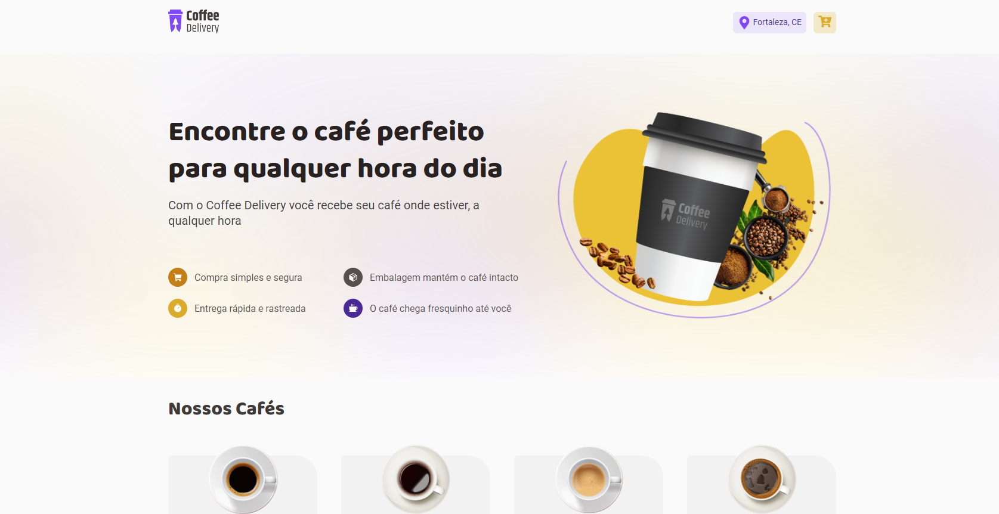
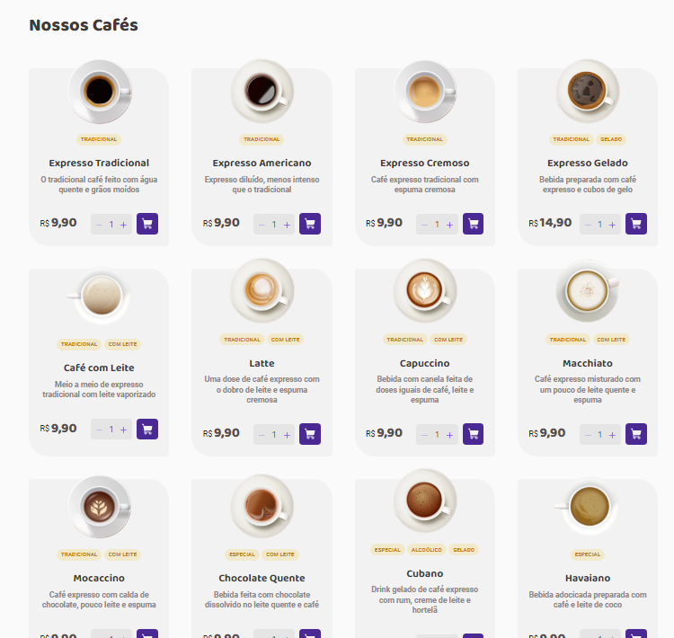
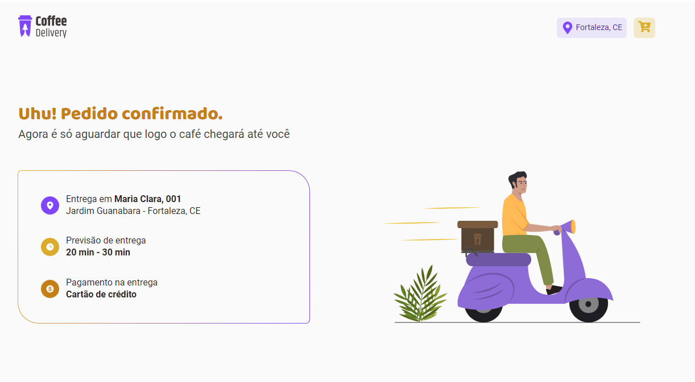

# React + TypeScript + Vite
## Coffee Delivery

- Projeto feito para cumprir desafio do módulo 02 (dois) do curso ignite da Rocketseat  

## Coffee Delivery - App loja virtual de delivery de café construida com react.js e typeScript

## :dart:  Desafio

O projeto Coffee Delivery, consiste em construir um app de delivery de uma loja de cafés, onde é possível escolher entre vários tipos de cafés,

após a escolha ao clicar no carrinho de compras o cliente é redirecionado para apágina de confirmação do pedido, onde, serão pedidos os dados para entrega, forma de pagamento e é mostrado o valor total da compra juntamente com os produtos escolhidos com seus respectivos valores, esse formulário foi validado e só é permitido fechar a compra após o preenchimento de todas as informações obrigatórias,

 ao clicar em CONFIRMAR PEDIDO, novamente o cliente é redirecionado para uma ultima página onde é possível conferir os dados digitados no formulário anterior, como endereço e forma de pagamento.

## :nut_and_bolt: Tech

* Router
* tratamento de error
* REACT
* Context
* React hooks (UseStates, UseForm e UseEffects)
* ESLint e Prettier
* VITE
* STYLED-COMPONENTS
* React-router-dom
* javascript

## :mailbox_closed: Contatos

> Email - rosendc30@gmail.com

> Github: https://github.com/rosendo2015/coffeeDelivery

> Linkedin - https://www.linkedin.com/in/francisco-rosendo-coelho/
